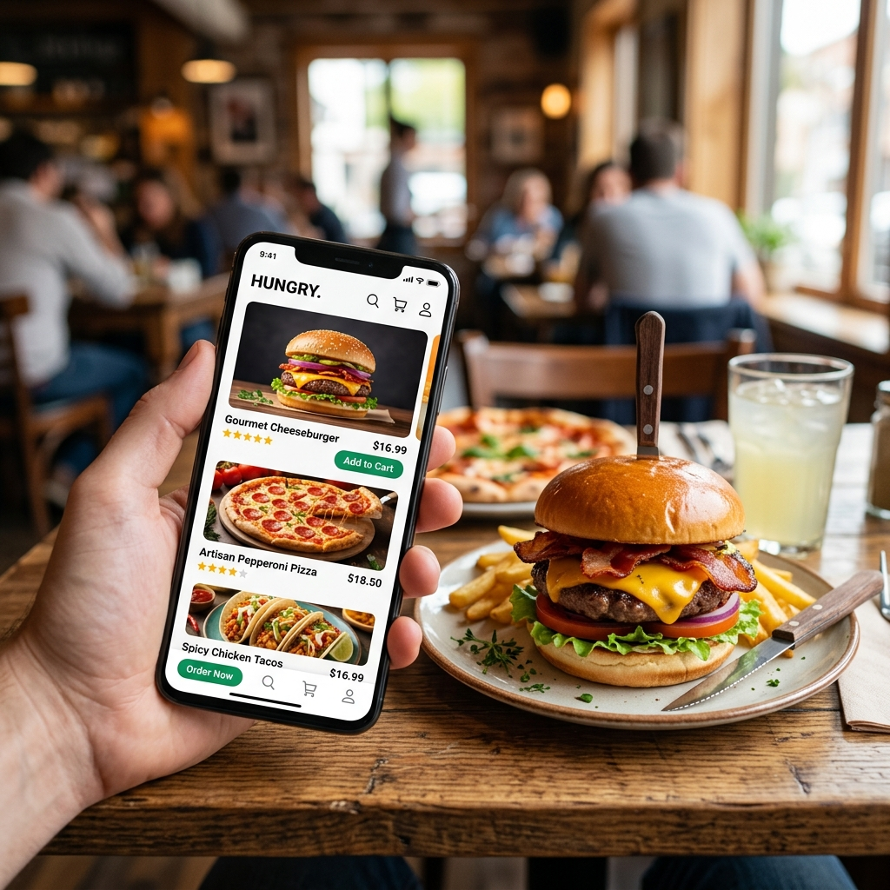

<div align="center">
  
  
  # 🍔 Food Ordering System

  **A modern, comprehensive web application built with Flask and PostgreSQL for managing food delivery operations.**

  [](https://python.org)
  [](https://flask.palletsprojects.com/)
  [](https://www.postgresql.org/)
  [](https://opensource.org/licenses/MIT)

  <p align="center">
    <a href="#sparkles-features">Features</a> •
    <a href="#rocket-getting-started">Getting Started</a> •
    <a href="#computer-tech-stack">Tech Stack</a> •
    <a href="#shield-admin-access">Admin Access</a>
  </p>
</div>

---

## ✨ Features

- **User Authentication**: Secure register, login, and logout functionalities powered by JWT.
- **Restaurant Browsing**: Browse through a variety of restaurants and explore their detailed menus.
- **Shopping Cart**: Dynamic cart functionality to seamlessly add, modify, and review items before checkout.
- **Order Tracking**: Place orders and view a comprehensive order history with status tracking.
- **User Profile**: Custom profiles for users to manage their details and history.
- **Admin Dashboard**: A powerful control panel for administrators to manage menus, restaurants, and user analytics.
- **Responsive Design**: Beautiful dark-mode UI optimized for both desktop and mobile viewing.

## 🚀 Getting Started

Follow these steps to get the application up and running locally:

### Prerequisites
Make sure you have Python 3.11+ installed.

### Installation

1. **Clone the repository:**
   ```bash
   git clone https://github.com/Nandhagokul-R/Food-Ordering-System.git
   cd Food-Ordering-System
   ```

2. **Install dependencies:**
   We recommend using a virtual environment:
   ```bash
   python -m venv venv
   source venv/bin/activate  # On Windows: venv\Scripts\activate
   pip install -r requirements.txt
   ```
   *(Note: The project uses `pyproject.toml` and supports `uv` for lightning-fast installs).*

3. **Run the application:**
   ```bash
   python main.py
   ```
   The application will automatically initialize the SQLite/PostgreSQL database with demo data.

4. **Access the application:**
   Open your browser and navigate to `http://127.0.0.1:5000`.

## 🛡️ Admin Access

A demo admin account is provisioned automatically upon startup to test the dashboard features.

- **Username:** `admin`
- **Password:** `admin@123`

## 💻 Tech Stack

- **Backend**: Python, Flask, SQLAlchemy, Flask-Login, Flask-JWT-Extended
- **Database**: PostgreSQL / SQLite (for local testing)
- **Frontend**: HTML5, CSS3, JavaScript (Vanilla), Bootstrap 5
- **Icons**: FontAwesome 6

## 🔌 API Endpoints

The system also offers RESTful API endpoints for integration:
- `GET /api/restaurants` - List all restaurants
- `GET /api/restaurants/<id>` - Detailed info for a specific restaurant
- `POST /api/cart` - Add/remove items from the cart
- `GET /api/orders` - View and manage user orders
- `GET /api/profile` - User profile information

## 🤝 Contributing

Contributions are welcome! Feel free to open an issue or submit a Pull Request if you have suggestions or bug fixes.

---
<div align="center">
  <p>Made with ❤️ by Nandhagokul</p>
</div>